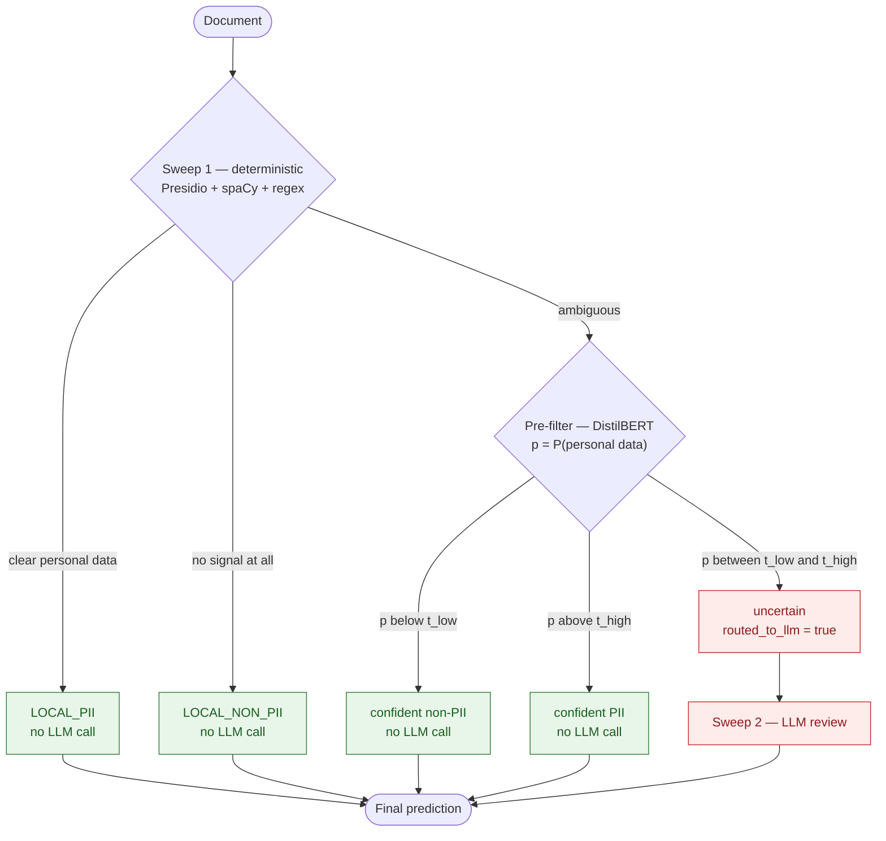

# PII Detection

Cost-aware detection of GDPR personal data in documents: deterministic
detectors, a transformer pre-filter and an LLM review stage, arranged so that
expensive LLM calls are spent only on the documents that actually need them.


TUM *Deep Learning and Decision Making*, Bosch case study. This is a university
case study, not a production system.

## Success criterion

Not accuracy. **How far LLM call volume drops while document-level recall stays
at or above the rule-based baseline of 0.9833.** Under GDPR a false negative
costs more than a false positive, so whenever the router is unsure it escalates
rather than decides.

## Pipeline



The two Sweep 1 short-circuits and the two confident pre-filter zones all
terminate without an LLM call. Only the uncertain band in the middle is paid
for.

## Where things are

| document | covers |
|---|---|
| this file | project overview, setup, entry points, current status |
| [`classification/README.md`](classification/README.md) | the classification pipeline: Sweep 1, routing, evaluation, module layout |
| [`classification/prefilter/README.md`](classification/prefilter/README.md) | the transformer pre-filter: calibration, output contract, findings, full results |

## Setup

```bash
python -m venv .venv
source .venv/bin/activate

pip install -r requirements.txt   # backend and classification dependencies
pip install -e .                  # project in editable mode, installs the console scripts
```

The pre-filter additionally needs the deep-learning stack, which
`requirements.txt` does not cover:

```bash
pip install torch transformers scikit-learn matplotlib mlflow
```

`pyproject.toml` declares `requires-python >= 3.10`; the environment these
results were produced in is Python 3.11 with PyTorch 2.13.0 and Transformers
5.15.1.

<details>
<summary><strong>Pretrained weights without HuggingFace access</strong></summary>

`huggingface.co` is blocked by this execution environment's egress policy, so
`from_pretrained("distilbert-base-uncased")` fails outright. The weights are
pulled from the legacy public model bucket instead and written to the
git-ignored `models/` directory:

```bash
python -m classification.prefilter.fetch_model
```

Training and inference then load from disk. Anyone with normal HuggingFace
access can skip this step and point `--pretrained-dir` at a model id.

</details>

## Entry points

Console scripts installed by `pip install -e .`:

| command | module |
|---|---|
| `classify` | `classification.pipeline` |
| `evaluate` | `classification.evaluation.evaluate_pipeline` |
| `update-dataset` | `classification.data.update_dataset_schema` |

The classification pipeline also runs as a module: `python -m classification.pipeline`.

Pre-filter module entry points:

| command | what it does |
|---|---|
| `python -m classification.prefilter.fetch_model` | downloads the pretrained encoder into `models/` |
| `python -m classification.prefilter.eda` | dataset report, split sanity check, `max_length` recommendation |
| `python -m classification.prefilter.train` | trains the model and calibrates the routing thresholds |
| `python -m classification.prefilter.predict` | writes evaluation-compatible predictions |
| `python -m classification.prefilter.error_report` | error and routing-cost slices |
| `python -m classification.prefilter.compare_runs` | side-by-side figures for two or more runs |
| `python -m pytest classification/prefilter/tests/` | 47 checks — 21 on the routing logic, 26 on documentation consistency; no model required |

### Output artifacts

`predict` writes into `classification/results/runs/<run_id>/` — the same place
the rest of the pipeline writes to — so its output is scored with
`evaluate --run-id <run_id>` and no extra wiring.

| file | what it is |
|---|---|
| `rule_plus_bert.csv` | the routed pipeline; the registered strategy |
| `bert_prefilter.csv` | the standalone model decision, no routing |
| `run_metadata.json` | routing rate, LLM calls avoided, inference timing |

Training publishes per-run artifacts — routing frontier, calibration, training
history, error slices — to `classification/prefilter/reports/<run_name>/`, one
directory per run.

## Pre-filter status

The model is a DistilBERT encoder shared by two heads: a binary personal-data
head and a 12-label GDPR entity head (PERSON, EMAIL_ADDRESS, PHONE_NUMBER,
LOCATION, IBAN_CODE, CREDIT_CARD, PASSPORT, NRP, DATE_TIME, IP_ADDRESS, URL,
MEDICAL_LICENSE). The binary head is the deliverable; the entity head needs a
larger dataset before its numbers mean anything.

### Run 1 — `distilbert_prefilter`, 500-row pilot

| metric | validation | test |
|---|---|---|
| accuracy / precision / recall / F1 | 1.0000 | 1.0000 |
| PR-AUC | 1.0000 | — |
| **documents routed to the LLM** | **0.0%** | **0.0%** |
| pre-filter recall (baseline 0.9833) | 1.0000 | 1.0000 |
| missed positives | 0 | 0 |

**These numbers must not be quoted without their caveat.** The pilot is close to
linearly separable — negatives score 0.00–0.05, positives 0.93–1.00, and the
band between them is empty — so there is no uncertain zone left to route. The
0.0% is a degenerate outcome of an easy dataset, not a validated capability.

<details>
<summary>Run 1 configuration and cost</summary>

`distilbert-base-uncased`, `max_length` 256, stratified fallback split
(370 / 63 / 67), seed 42, 8 epochs, selected epoch 2. Training 823.6 s on 4 CPU
cores; inference 63.9 ms per document; 66.96 M parameters, 255.4 MB fp32.

The reason for the fallback split, the entity-head per-label numbers, and the
open findings about the evaluation module and the dataset splits are in
[`classification/prefilter/README.md`](classification/prefilter/README.md).

</details>

### Run 2 — `mbert_prefilter_1400`, 1,400-row dataset

**In progress; results pending.** `distilbert-base-multilingual-cased`,
`max_length` 512, split mode `auto` resolving to the dataset's own
`recommended_split`, seed 42, 5 epochs. The one figure available so far is from
its **first epoch**: 27.6% of documents routed at a PR-AUC of 0.8965. That is an
in-progress number and not a result, but it does show the trade-off curve is no
longer degenerate on the larger dataset — there is an uncertain band to route,
so the routing rate becomes a figure worth measuring.

The 1,400-row set lives on `AstouK/pii_detection`, branch
`feature/synthetic-data-generation`, at
`classification/data_generation/output/synthetic_dataset_1400.csv`. Same
44-column schema as the pilot: 714 English / 686 German, 12% positive,
positives present in all three splits. It is fetched into the git-ignored
`classification/data/external/` and passed with `--data-file`, never vendored
into this branch.
