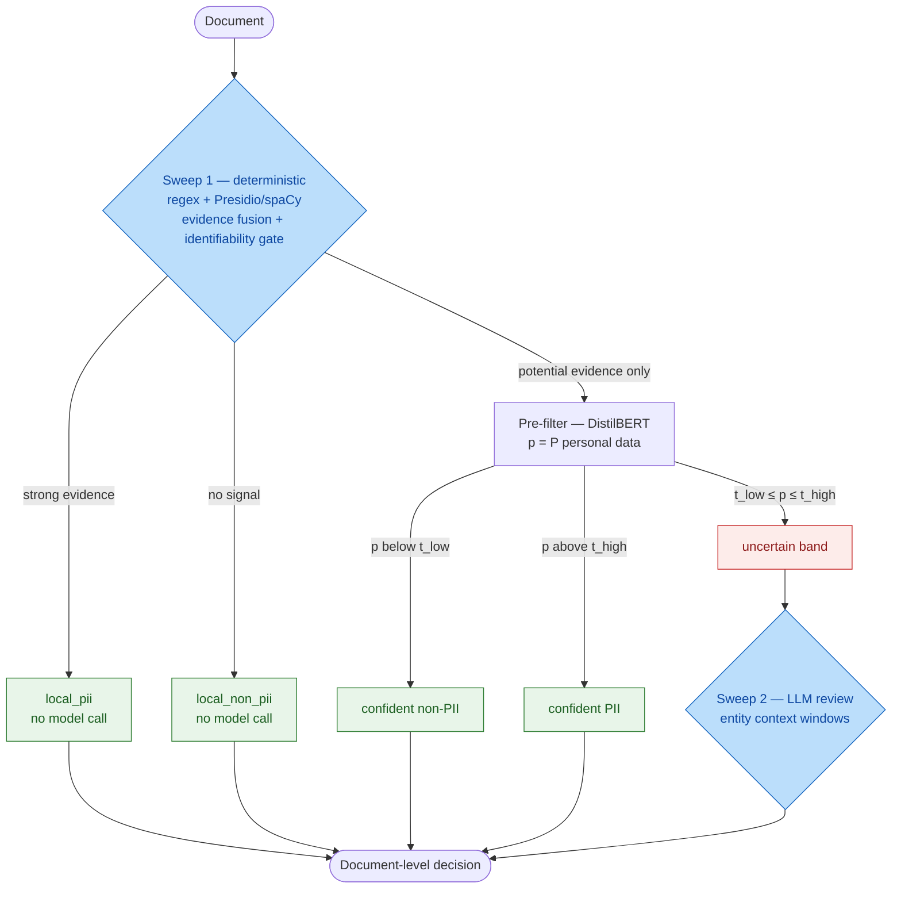

# GDPR PII Detection

Cost-aware detection of GDPR personal data in unstructured enterprise
documents. A deterministic first pass resolves clear cases locally; only
ambiguous documents are routed to a transformer pre-filter and, if still
uncertain, to a targeted LLM review.


TUM *Deep Learning and Decision Making*, Bosch case study. This is a university
project, not a production system.

## Abstract

To comply with international regulations protecting personal data, such as GDPR
in Europe and IPA in US, organizations must identify personal data scattered
across unstructured enterprise documents, but the scale of company data renders
manual audits inefficient, and hardly scalable. A program to help flag and
review documents containing personal data would be a great compliance tool for
companies. Our proposed approach, focused on GDPR regulation, shows that purely
rule-based detectors are fast and cheap but struggle with context-dependent
evidence (e.g., a location is personal data only when tied to an identified
individual), and we show this weakness is commonly patched with
dataset-specific rule engineering that does not generalize. Purely LLM-based
review, on the other hand, is accurate but too costly to apply to every
document. We therefore propose a two-sweep pipeline: a deterministic
rule-based first pass, gated by a structural evidence rules grounded in GDPR,
routes only ambiguous documents to a targeted LLM review stage.

On a 3,500-document bilingual benchmark, the deployed rule-based baseline
alone reaches P=0.9930, R=0.6762, F1=0.8045, missing nearly a third of true
positives despite near-perfect precision. Routing its ambiguous documents to a
low-cost LLM reviewer lifts recall to 0.9746 at F1=0.9586 (P=0.9432), while a
locally hosted reviewer that keeps document text on-premise trades that recall
back down (P=0.9872, R=0.7317, F1=0.8405). Our best configuration inserts a
lightweight DistilBERT pre-filter ahead of the LLM stage and reaches
F1=0.9968 (P=0.9968, R=0.9968) at near-zero marginal cost and a fraction of
the LLM pipeline's runtime.

## Technical definitions

These terms are used throughout the code, the evaluation, and the report.

| Term | Meaning |
|---|---|
| **Personal data (GDPR Art. 4(1))** | Any information relating to an identified or identifiable natural person. A city or a date is not personal data on its own; it becomes so only when it can be tied to an individual. |
| **Document-level decision** | The primary task: binary label *does this document contain personal data?* Entity spans are extracted only in Sweep 1 so they stay comparable across strategies. |
| **Sweep 1** | Deterministic first pass: regex + Microsoft Presidio/spaCy, then evidence fusion. Fast, cheap, explainable. Resolves documents that are clearly positive or clearly empty. |
| **Strong evidence** | Format-bound identifiers that are near-unambiguous on their own: `EMAIL_ADDRESS`, `PHONE_NUMBER`, `IBAN_CODE`, `CREDIT_CARD`, `PASSPORT`, `IP_ADDRESS`, `EMPLOYEE_ID`, `USER_ID`, `MEDICAL_LICENSE`. Presence → `local_pii`, no model call. |
| **Potential evidence** | Context-dependent types: `PERSON`, `LOCATION`, `DATE_TIME`, `ADDRESS`, `DATE_OF_BIRTH`, `NRP`, `URL`. Not sufficient for a local positive; the document is marked ambiguous. |
| **Identifiability gate** | Structural GDPR rule that decides when potential evidence counts. **V1** (document-wide person-anchor): `LOCATION` / `DATE_TIME` count only if a `PERSON` is also present; otherwise the document is resolved locally as negative. **V2** (proximity): a `DATE_TIME` is kept only if a `PERSON` or `LOCATION` lies within 200 characters; `LOCATION` is retained. V1 is used when the next stage is a paid LLM (fewer escalations). V2 is used when the next stage is DistilBERT (escalation is nearly free). |
| **Evidence fusion** | Union of regex and Presidio spans, grouped by type. Confidence is the max span score, plus a +0.3 boost when both detectors independently report the same type. |
| **Route** | Categorical Sweep 1 outcome, not a probability cut. `local_pii` (strong evidence), `local_non_pii` (no signal), `low_cost_llm` (potential evidence only). |
| **Sweep 2** | LLM review of ambiguous documents. The reviewer sees merged ±200-character windows around detected entities, not the full document. Temperature 0, JSON schema. It may turn an ambiguous document positive, but never overturns strong evidence (a well-formed IBAN stays positive). |
| **Pre-filter** | Fine-tuned DistilBERT (`distilbert-base-multilingual-cased`) with a binary PII head and an auxiliary 12-label entity head. Scores only Sweep 1's ambiguous documents. |
| **Three-zone router** | Two thresholds on \(p = P(\text{personal data})\): \(p < t_{\text{low}}\) → confident non-PII; \(p > t_{\text{high}}\) → confident PII; otherwise uncertain and forwarded to Sweep 2. Routing is not an error: the document still gets a stronger reviewer. The irrecoverable mistakes are silently dropping a positive below \(t_{\text{low}}\), or auto-approving a negative above \(t_{\text{high}}\). |
| **Calibration objective** | Fit \(t_{\text{low}}, t_{\text{high}}\) on validation by minimising the routed fraction \(\rho\), subject to pre-filter recall \(\ge 0.98\) and auto-approved precision \(\ge 0.90\). |
| **Strategy** | A registered combination of stages, executed by `classify` and scored by `evaluate`. See [Strategies](#strategies). |

**Design rule.** Under GDPR a missed positive is a compliance failure; a false
positive only costs a reviewer a few minutes. Whenever a stage is unsure, it
escalates rather than decides.

## Pipeline



Systems A–D omit the pre-filter and send Sweep 1's ambiguous set straight to
Sweep 2. Systems E and F insert DistilBERT, so only its uncertain band is
forwarded.

The final hybrid decision is: strong Sweep 1 evidence **or** (ambiguous **and**
the later stage says yes). Strong evidence is never overturned.

## Strategies

Registered in `classification/config.py` (`STRATEGY_REGISTRY`). Run any subset
with `classify --strategies <name> ...`.

| ID | Strategy name | What it does |
|---|---|---|
| A | `rule_based` | Sweep 1 only. Strong-evidence positives. |
| A′ | *(diagnostic)* | Sweep 1 counting any evidence as positive. Recall ceiling of the rule layer, not a deployed system. |
| B | `rule_plus_qwen` | Sweep 1 + Qwen3.7 on the ambiguous set (DashScope). |
| C | `rule_plus_gpt4o_mini` | Sweep 1 + GPT-4o mini (OpenRouter). |
| D | `rule_plus_ollama` | Sweep 1 + local Qwen2.5 via Ollama. Document text stays on-premise. |
| E | `rule_plus_distilbert` | Sweep 1 + DistilBERT on the ambiguous set. No LLM. |
| F | `rule_plus_distilbert_plus_qwen` | Sweep 1 + DistilBERT three-zone router + Qwen on the remaining band. |
| — | `bert_distilbert` | DistilBERT on every document. No Sweep 1 gate. Diagnostic, not the deployed hybrid. |

Default `STRATEGIES_TO_RUN` is whatever is currently set in `config.py`;
override it on the command line rather than editing the file for a one-off run.

## Benchmark

Same 3,500-document bilingual corpus, same Sweep 1 output, document-level
metrics. A–D use gate V1 (279 escalated); E and F use gate V2 (699). Only C
incurs provider cost (\$0.028).

| | Approach | Prec. | Rec. | F1 | Runtime (s) |
|---|---|---:|---:|---:|---:|
| A | rules, strong evidence | 0.9930 | 0.6762 | 0.8045 | 0.06 |
| A′ | rules, any evidence (ceiling) | 0.8715 | 0.9794 | 0.9223 | 0.06 |
| B | rules + Qwen3.7 | 0.9432 | 0.9746 | 0.9586 | 453.97 |
| C | rules + GPT-4o mini | 0.9410 | 0.9619 | 0.9513 | 410.93 |
| D | rules + local Qwen2.5 | 0.9872 | 0.7317 | 0.8405 | 1387.90 |
| E | rules + DistilBERT | 0.9952 | 0.9968 | 0.9960 | 31.71 |
| F | rules + DistilBERT + LLM | 0.9968 | 0.9968 | 0.9968 | 34.69 |

On this corpus the calibrated DistilBERT band collapsed to
\(t_{\text{low}} = t_{\text{high}} = 0.925\), so F made no LLM calls and
reduces to E. The headline F1 should not be quoted without that caveat: the
synthetic positives are lexically marked (Faker names, IBANs) while negatives
carry placeholders, which makes the encoder's job easier than a real corpus
would.

## Repository layout

| Path | Role |
|---|---|
| [`classification/`](classification/README.md) | Production pipeline: Sweep 1, routing, strategies, outputs |
| [`classification/detectors/`](classification/README.md) | Regex, Presidio, evidence fusion |
| [`classification/review/`](classification/README.md) | Sweep 1 route decision, Sweep 2 LLM reviewer |
| [`classification/prefilter/`](classification/prefilter/README.md) | DistilBERT training, calibration, prediction |
| [`classification/evaluation/`](classification/evaluation/README.md) | Metrics, error analysis, benchmarking, MLflow |
| [`classification/data_generation/`](classification/data_generation/README.md) | Synthetic bilingual corpus generator |
| `classification/data/` | Input datasets; git-ignored `external/` |
| `classification/results/runs/<run_id>/` | Prediction CSVs and `run_metadata.json` |
| `classification/evaluation/results/runs/<run_id>/` | Scored metrics and error slices |
| `config/` | Logging and secret-backed settings (API keys from `.env`) |
| `Bericht/` | Project report (LaTeX) |

Prediction (`classification/`) and evaluation (`classification/evaluation/`)
are separate on purpose: a saved run can be rescored later, and a new model
can be compared against old runs without rerunning them.

## Dataset

Default input: `classification/data_generation/output/synthetic_dataset_3500.csv`.

| | |
|---|---|
| Size | 3,500 documents (14 enterprise archetypes × 250) |
| Languages | German 1,722 / English 1,778 |
| Labels | 675 positive (19.3%) / 2,825 negative |
| Splits | train 2,450 / validation 532 / test 518 |
| Required column | `full_text` |
| Document label | `contains_personal_data` / `ground_truth_pii` |
| Entity labels | `<ENTITY_TYPE>_yes_no` |

Archetypes: `contract`, `customer_support`, `employee_record`,
`expense_report`, `general_document`, `incident_report`, `internal_email`,
`invoice`, `it_access_request`, `medical_record`, `meeting_notes`,
`passport_record`, `supplier_onboarding`, `training_evaluation`.

Generation is two-layered: deterministic Faker placement, then GPT-4o mini
rewrites designated free-text fields under a contract that must reproduce the
planned identifiers. Override the input for a one-off run with
`classify --input-file <path>`.

The older 500-row English pilot at `classification/data/pii_dataset.csv` is no
longer the default.

## Setup

```bash
python -m venv .venv
source .venv/bin/activate

pip install -r requirements.txt   # backend + classification
pip install -e .                  # console scripts: classify, evaluate, update-dataset
```

`pyproject.toml` declares `requires-python >= 3.10`. Results in this README
were produced with Python 3.11, PyTorch 2.13.0 and Transformers 5.15.1.

The pre-filter additionally needs the deep-learning stack:

```bash
pip install torch transformers scikit-learn matplotlib mlflow
```

spaCy models used by Presidio:

```bash
python -m spacy download en_core_web_sm
python -m spacy download de_core_news_sm
```

Copy `.env.example` to `.env` and set provider credentials
(`OPENROUTER_API_KEY`, `QWEN_API_KEY`). Local Ollama defaults are
`http://localhost:11434/v1` and `qwen2.5`.

<details>
<summary><strong>Pretrained weights without HuggingFace access</strong></summary>

If `huggingface.co` is blocked, fetch the encoder into the git-ignored
`models/` directory:

```bash
python -m classification.prefilter.fetch_model
```

Training and inference then load from disk. With normal HuggingFace access,
skip this and point `--pretrained-dir` at a model id
(deployed run: `distilbert-base-multilingual-cased`).

</details>

## Entry points

Console scripts from `pip install -e .`:

| Command | Module |
|---|---|
| `classify` | `classification.pipeline` |
| `evaluate` | `classification.evaluation.evaluate_pipeline` |
| `update-dataset` | `classification.data.update_dataset_schema` |

```bash
# Sweep 1 + selected strategies
classify --strategies rule_based rule_plus_qwen rule_plus_distilbert

# Score a saved classification run (does not rerun models)
evaluate --run-id 20260909_131333

# Generate the 3,500-document corpus
python -m classification.data_generation.generate --documents-per-scenario 250
```

Pre-filter module commands:

| Command | What it does |
|---|---|
| `python -m classification.prefilter.fetch_model` | Download the pretrained encoder into `models/` |
| `python -m classification.prefilter.eda` | Dataset report, split sanity check, `max_length` |
| `python -m classification.prefilter.train` | Train and calibrate routing thresholds |
| `python -m classification.prefilter.overfit_check` | Train/val/test gap at frozen validation thresholds |
| `python -m classification.prefilter.predict` | Write evaluation-compatible predictions |
| `python -m classification.prefilter.error_report` | Error and routing-cost slices |
| `python -m pytest classification/prefilter/tests/` | Routing-logic checks; no model required |

### Classification outputs

Each `classify` run writes `classification/results/runs/<run_id>/`:

```text
sweep1.csv              # Sweep 1 baseline (if any selected strategy needs it)
<strategy>.csv          # one file per strategy
run_metadata.json       # routing rates, token usage, timings
```

`evaluate` reads that directory and writes
`classification/evaluation/results/runs/<run_id>/` (per-strategy metrics,
FP/FN slices, `benchmark_summary.csv`).

### Local Ollama (strategy D)

```bash
ollama serve
ollama pull qwen2.5
classify --strategies rule_plus_ollama
```

Without a running Ollama server, any run that includes `rule_plus_ollama`
fails when it reaches that strategy.

## Evaluation metrics

Document-level, against `ground_truth_pii` (fallback: `contains_personal_data`):

| Metric | Definition |
|---|---|
| Precision | \(\mathrm{TP}/(\mathrm{TP}+\mathrm{FP})\) |
| Recall | \(\mathrm{TP}/(\mathrm{TP}+\mathrm{FN})\) |
| F1 | Harmonic mean of precision and recall; primary comparison metric |
| Accuracy | \((\mathrm{TP}+\mathrm{TN})/n\) |

Routing and cost are reported alongside: documents sent to review, local
resolution rate, LLM tokens, DistilBERT runtime. Per-entity metrics are derived
from `<ENTITY_TYPE>_yes_no` columns.

## Further reading

- [`classification/README.md`](classification/README.md) — Sweep 1, routing, module layout
- [`classification/prefilter/README.md`](classification/prefilter/README.md) — calibration, output contract, training runs
- [`classification/evaluation/README.md`](classification/evaluation/README.md) — scoring, error analysis, MLflow
- [`classification/data_generation/README.md`](classification/data_generation/README.md) — corpus generator
- [`Bericht/project_report_pii_detection.tex`](Bericht/project_report_pii_detection.tex) — full write-up
