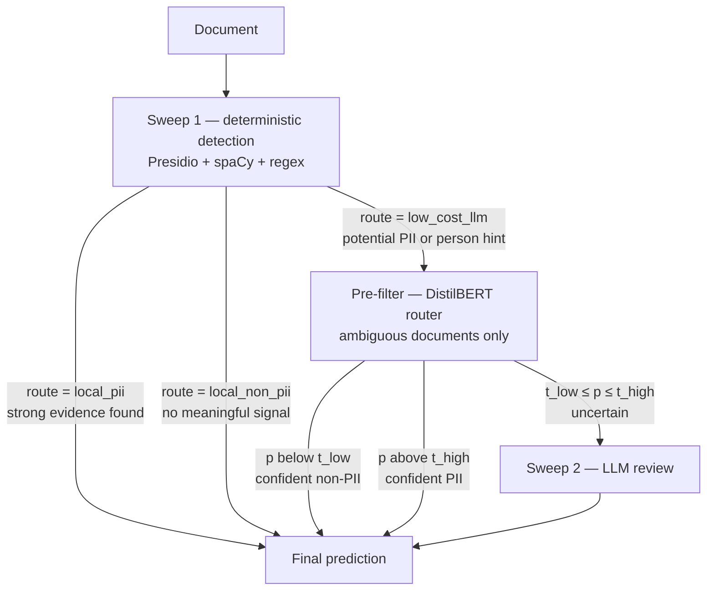

# Classification Module

Cost-aware GDPR personal-data classification: a hybrid pipeline that answers
*what prediction should we make?* for a document, spending an LLM call only
where the cheaper stages cannot decide.

Related documents: [project overview](../README.md) ·
[transformer pre-filter](prefilter/README.md) ·
[evaluation framework](evaluation/README.md)

## Pipeline overview



Both stages that end at *Final prediction* without passing through Sweep 2 cost
no LLM call. The objective of the module is to move as much traffic as possible
into those branches without losing document-level recall.

## Package layout

| Path | What lives here |
|---|---|
| `pipeline.py` | Orchestrates a full run: load, Sweep 1, strategies, outputs, metadata |
| `sweep1.py` | Deterministic detection pass over the dataset |
| `config.py` | Model registry, strategy registry, output-metadata defaults |
| `config1.py` | Temporary shim so the evaluation modules import successfully; see the findings section of [`prefilter/README.md`](prefilter/README.md) |
| `strategy_router.py` | Strategy validation; routing logic is a stub for now |
| `gdpr_entities.yaml` | Entity vocabulary shared by the detectors |
| `detectors/` | `regex_detector.py`, `presidio_detector.py`, `evidence_fusion.py` |
| `prefilter/` | Transformer router — training, calibration, prediction, reports |
| `review/` | `routing.py` (Sweep 1 route decision), `llm_reviewer.py` (Sweep 2) |
| `infrastructure/` | `io.py`, `metadata.py`, `outputs.py`, `runtime.py`, `strategy_runner.py` |
| `evaluation/` | Scoring, error analysis, benchmarking, MLflow logging |
| `data/` | Input dataset, schema updater, git-ignored `external/` |
| `data_generation/` | Synthetic dataset generation |
| `results/runs/<run_id>/` | Per-run prediction outputs and metadata |
| `requirements.txt` | Dependencies of this package |

## Sweep 1: deterministic detection

| | |
|---|---|
| Implemented in | `sweep1.py` |
| Components | `detectors/regex_detector.py`, `detectors/presidio_detector.py`, `detectors/evidence_fusion.py`, `review/routing.py` |
| Languages | `en`, `de` — Presidio is configured with `en_core_web_sm` and `de_core_news_sm` |

Responsibilities:

- Detect structured identifiers with regex.
- Detect entities with Microsoft Presidio.
- Fuse detector evidence into one per-document view.
- Categorize evidence as strong or contextual.
- Decide whether LLM review is required.

The route decision has exactly three outcomes, and they are what the rest of
the pipeline is built around:

| `route` | `routing_reason` | `needs_llm_review` |
|---|---|---|
| `local_pii` | `strong_pii_detected` | `False` |
| `low_cost_llm` | `potential_pii_or_person_hint` | `True` |
| `local_non_pii` | `no_meaningful_signal` | `False` |

<details>
<summary>Sweep 1 output columns</summary>

| Column | Meaning |
|---|---|
| `detected_categories` | All entity types any detector fired on |
| `strong_pii_categories` | Categories treated as strong evidence |
| `potential_pii_categories` | Categories treated as contextual evidence only |
| `detected_any_pii` | Any detector fired at all |
| `detected_pii` | Strong evidence present — the rule-based decision |
| `entities` | Per-entity detector spans |
| `per_type_conf` | Entity type to confidence, as a dict |
| `route` | `local_pii` / `low_cost_llm` / `local_non_pii` |
| `routing_reason` | Why that route was chosen |
| `needs_llm_review` | Whether the document continues to the next stage |

</details>

## Pre-filter: transformer routing

Implemented in `prefilter/`. It sits between Sweep 1 and the LLM review and
decides which of Sweep 1's *ambiguous* documents actually need an LLM call.

Model — one shared DistilBERT encoder, two heads:

| Head | Output |
|---|---|
| Binary | Personal data yes/no — the routing signal |
| Multi-label | 12 GDPR entity labels |

The 12 labels: `PERSON`, `EMAIL_ADDRESS`, `PHONE_NUMBER`, `LOCATION`,
`IBAN_CODE`, `CREDIT_CARD`, `PASSPORT`, `NRP`, `DATE_TIME`, `IP_ADDRESS`,
`URL`, `MEDICAL_LICENSE`.

Responsibilities:

- Score ambiguous documents with a local model.
- Calibrate a low and a high routing threshold.
- Auto-decide the confident documents and escalate the uncertain ones.
- Write evaluation-compatible predictions.

**Success criterion — not accuracy.** How far LLM call volume drops while
document-level recall stays at or above the rule-based baseline of **0.9833**.
False negatives are more expensive than false positives under GDPR, so the
router escalates when unsure.

### Entry points

| Command | What it does |
|---|---|
| `python -m classification.prefilter.fetch_model` | Downloads the pretrained encoder into `models/` |
| `python -m classification.prefilter.eda` | Dataset report, split sanity check, `max_length` recommendation |
| `python -m classification.prefilter.train` | Trains and calibrates the router |
| `python -m classification.prefilter.predict` | Writes evaluation-compatible predictions |
| `python -m classification.prefilter.error_report` | Error and routing-cost slices |
| `python -m classification.prefilter.compare_runs` | Side-by-side figures for two or more runs |
| `python -m pytest classification/prefilter/tests/` | Routing-logic checks, no model required |

<details>
<summary>Pre-filter output columns</summary>

| Column | Meaning |
|---|---|
| `pii_probability` | Binary head score, for threshold and cost re-analysis |
| `routed_to_llm` | Whether this document costs an LLM call — the core metric |
| `routing_zone` | `confident_non_pii` / `routed_to_llm` / `confident_pii` |
| `t_low`, `t_high` | The operating point that produced the file |
| `per_type_conf` | Entity to confidence; required by `evaluation/metrics.py` |
| `<ENTITY>_predicted` × 12 | The multi-label head's own calls |
| `inference_ms` | Per-document inference time, for the cost analysis |

The full column contract, including the metadata columns the evaluation reads,
is in [`prefilter/README.md`](prefilter/README.md).

</details>

### Status

Run `distilbert_prefilter` on the 500-row pilot: accuracy, precision, recall
and F1 of 1.0000 on validation and test, 0.0% of documents routed to the LLM,
63.9 ms inference per document — but the pilot is close to linearly separable
(negatives score 0.00–0.05, positives 0.93–1.00, and the band between them is
empty), so there is no uncertain zone left to route and the 0.0% is a
degenerate outcome rather than a validated capability. The figure only becomes
meaningful on the larger 1,400-row dataset.

A second run (`mbert_prefilter_1400`, `distilbert-base-multilingual-cased` on
the 1,400-row set) is training; final numbers are pending. Its first epoch
routed 27.6% of documents at a PR-AUC of 0.8965 — an in-progress, single-epoch
figure, quoted only to show that the trade-off curve is no longer degenerate on
the larger dataset.

Details, caveats and the open findings about the splits and the evaluation
module: [`prefilter/README.md`](prefilter/README.md).

## Sweep 2: LLM review

Implemented in `review/llm_reviewer.py`.

Responsibilities:

- Review ambiguous documents.
- Build provider-specific prompts.
- Execute LLM requests.
- Parse structured responses.
- Produce contextual PII decisions.

Entry point:

```python
run_llm(df, model_id)
```

`model_id` is a key of `MODEL_REGISTRY` in `config.py` — for example
`qwen3_7_plus` (Qwen) or `gpt4o_mini` (OpenRouter).

<details>
<summary>Sweep 2 output columns</summary>

`llm_pii`, `llm_reason`, `llm_provider`, `llm_model_id`, `llm_model_name`,
`llm_prompt_tokens`, `llm_completion_tokens`, `llm_total_tokens`,
`llm_reasoning_tokens`

</details>

## Running the pipeline

```bash
source .venv/bin/activate

python -m classification.pipeline
```

`pip install -e .` also installs a `classify` console script for the same
entry point.

Execution flow:

1. Create the run directory and run id (`YYYYMMDD_HHMMSS`).
2. Validate the strategies in `STRATEGIES_TO_RUN`.
3. Load the input dataset.
4. Run Sweep 1 and save the baseline as `sweep1.csv`.
5. For each strategy: run it, compute the final prediction, save `<strategy>.csv`.
6. Compute routing metrics and save `run_metadata.json`.

## Input dataset

| | |
|---|---|
| Location | `classification/data/pii_dataset.csv` |
| Required column | `full_text` |
| Optional column | `language` — defaults to `en` when absent |
| Supported languages | `en`, `de` |

The dataset in this branch is the 500-row pilot: 5 document types,
60 positive / 440 negative, English only, 253–821 characters. The larger
1,400-row synthetic set is fetched into the git-ignored
`classification/data/external/` rather than vendored here.

## Results

Each run writes one directory under `classification/results/`:

```text
classification/results/
└── runs/
    └── <run_id>/
        ├── sweep1.csv
        ├── <strategy>.csv        # one per strategy in STRATEGIES_TO_RUN
        └── run_metadata.json
```

The pre-filter's `predict` writes into the same layout — `rule_plus_bert.csv`,
`bert_prefilter.csv` and `run_metadata.json` — so `evaluate --run-id <run_id>`
scores it with no extra wiring. Training artefacts go to
`classification/prefilter/reports/<run_name>/` instead.

## Metadata and benchmarking

<details>
<summary>Metadata fields on every prediction output</summary>

`run_id`, `strategy`, `provider`, `model_family`, `model_name`,
`prediction_source`, `prediction_stage`, `pipeline_name`, `predicted_pii`

The last seven come from `DEFAULT_OUTPUT_COLUMNS_TO_ADD` and the model registry
in `config.py`.

</details>

These fields let one metrics table compare:

| Approach | Status |
|---|---|
| Rule-based baseline | Runs today — `rule_based` |
| Qwen models | Runs today — `rule_plus_qwen` |
| OpenRouter models | Runs today — `rule_plus_gpt4o_mini` |
| DistilBERT pre-filter | Implemented in `prefilter/`; run via `prefilter.predict`, which writes `rule_plus_bert.csv` and `bert_prefilter.csv` directly |
| Hybrid rule + BERT + LLM | Registered in `STRATEGY_REGISTRY` (`rule_plus_distilbert_plus_qwen`), not yet in `STRATEGIES_TO_RUN` |

The BERT strategies exist in `STRATEGY_REGISTRY` but are not part of the
default `STRATEGIES_TO_RUN`, so `python -m classification.pipeline` does not
invoke the pre-filter yet; the pre-filter produces its runs through its own
`predict` entry point.

## Evaluation

Evaluation is implemented separately — see
[`evaluation/README.md`](evaluation/README.md). It operates on saved run
outputs and does not rerun classification.

Currently covered: accuracy, precision, recall, F1, confusion matrix, error
analysis, per-entity metrics, strategy benchmarking, runtime metrics, routing
metrics, MLflow tracking. Prompt benchmarking is still to be added.

## Design principle

| Module | Question it answers |
|---|---|
| `classification/` | What prediction should we make? |
| `classification/evaluation/` | How good was that prediction? |

Prediction and evaluation are kept separate so that a saved run can be rescored
later, and so that a new model can be benchmarked against old runs without
rerunning them.

## Dependencies

All project dependencies — the root file simply includes the backend and
classification requirement files:

```bash
pip install -r requirements.txt
```

Classification-specific dependencies only:

```bash
pip install -r classification/requirements.txt
```

The pre-filter additionally needs the deep-learning stack, which neither
requirements file covers:

```bash
pip install torch transformers scikit-learn matplotlib mlflow
```

Python 3.11 is the version in use in `.venv`.
