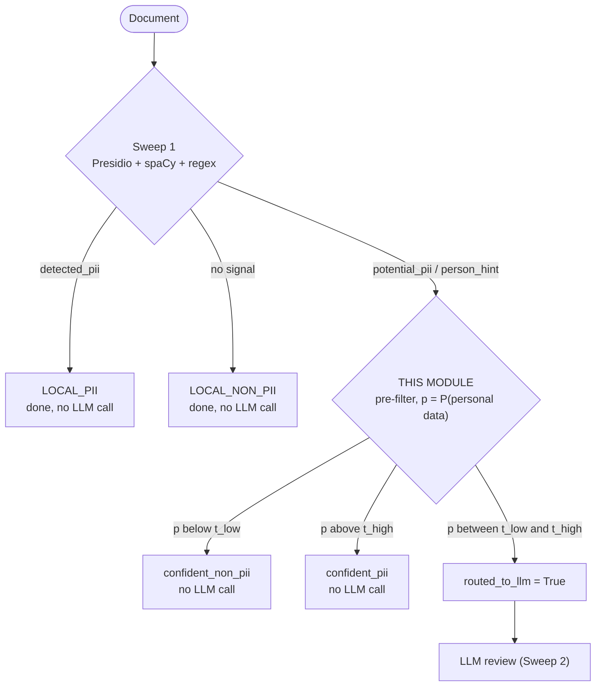
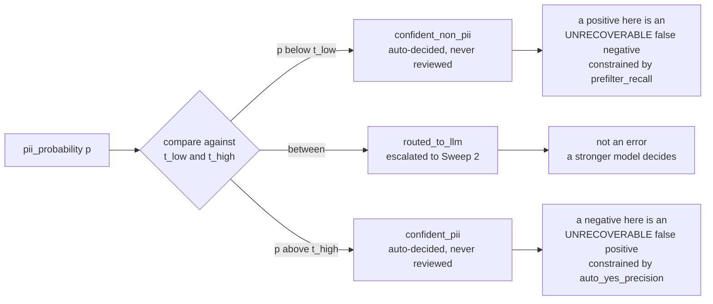

# Transformer Pre-Filter


Work package: **Max Seidlitz** · Branch: `claude/bert-prefilter-gdpr-pii-q35v0w`

A small transformer classifier that sits between Sweep 1 and the LLM review
stage and decides which of Sweep 1's ambiguous documents actually need an LLM
call.



Exactly: `p < t_low` is the confident non-PII zone, `p > t_high` the confident
PII zone, and everything else is routed.

The success criterion is **not** maximum accuracy. It is: *how far does the LLM
call volume drop while document-level recall stays at or above the rule-based
baseline of 0.9833?* False negatives are more expensive than false positives
under GDPR, so when in doubt the router escalates.

## Contents

| section | what is in it |
|---|---|
| [Quick start](#quick-start) | install, fetch weights, train, predict, score, slice errors |
| [Findings for the team](#findings-for-the-team) | seven verified findings, what was done about each, and who needs to act |
| [Results](#results) | Run 1 on the 500-row pilot, Run 2 on the 1,400-row set |
| [Read this before quoting the headline](#read-this-before-quoting-the-headline) | why the 0.0% routing rate is degenerate and must not be quoted bare |
| [Output interface](#output-interface) | the files and columns `predict` writes, and the evaluation contract they satisfy |
| [How the router is calibrated](#how-the-router-is-calibrated) | which recall is constrained, why there are two constraints, the frontier |
| [Model](#model) | architecture, `max_length`, model selection, reproducibility |
| [Offline weights](#offline-weights) | working around the blocked `huggingface.co` |
| [Files](#files) | what each module in this package does |
| [Not in scope](#not-in-scope) | what this work package deliberately does not cover |

Related: the [project overview](../../README.md) and the
[classification pipeline](../README.md).

---

## Quick start

```bash
# 1. Environment
pip install -r requirements.txt
pip install torch transformers scikit-learn matplotlib mlflow

# 2. Pretrained encoder (see "Offline weights" below)
python -m classification.prefilter.fetch_model

# 3. Look at the data before training on it
python -m classification.prefilter.eda

# 4. Train + calibrate the router
python -m classification.prefilter.train --epochs 6 --log-mlflow

# 5. Write evaluation-compatible predictions for the held-out test split
python -m classification.prefilter.predict --split test

# 6. Score them with the team's evaluation pipeline
evaluate --run-id <run_id printed by step 5>

# 7. Slice the errors for Sonja
python -m classification.prefilter.error_report
```

Comparing two runs — the frontier, the score distributions, the training
curves, the entity head and the headline metrics, side by side:

```bash
python -m classification.prefilter.compare_runs distilbert_prefilter mbert_prefilter_1400
```

The routing logic has its own checks, which need no model and run in about a
minute:

```bash
python -m pytest classification/prefilter/tests/ -q
```

---

## Findings for the team

Verified against the repo on 22.08. The first three are the points from the
brief; the last four came out of the data.

| # | finding | status | concerns | in one line |
|---|---|---|---|---|
| 1 | [`evaluate` does not run on `main`](#finding-1) | CONFIRMED — worked around | **Aissata** | Three modules import a `classification.config1` that does not exist; a temporary shim restores it. |
| 2 | [Split value mismatch](#finding-2) | CONFIRMED — currently harmless | **Aissata** | `EVALUATION_SPLITS = ["eval", "test"]` never matches the dataset's `validation`, but nothing reads the constant yet. |
| 3 | [Dataset in the repo is the old pilot](#finding-3) | CONFIRMED | informational | 500 rows, English only; the code depends on the schema, not the row count, so the larger set drops in unchanged. |
| 4 | [`recommended_split` is unusable](#finding-4) | NEW — blocks Phase 3, worked around | **Sonja** | All 60 positives sit in `train`, so recall — the deliverable — is undefined on validation and test. |
| 5 | [Duplicate documents leak across splits](#finding-5) | NEW — worked around | **Sonja** | 171 of 500 rows repeat another row's text and 32 duplicate groups span splits. |
| 6 | [Two metadata columns leak the label](#finding-6) | NEW | any model reading the metadata columns | `difficulty == "medium"` and `challenge_category == "medical_context"` are 100% positive. |
| 7 | [Cost analysis reads keys nobody writes](#finding-7) | NEW, minor — worked around | **Aissata** | Reader and writer disagree on two key names, so every cost column comes out zero. |

<a id="finding-1"></a>
<details>
<summary><strong>1. <code>evaluate</code> does not run on <code>main</code> — CONFIRMED</strong></summary>

`evaluation/config.py`, `evaluation/io.py` and `infrastructure/io.py` all import
`classification.config1`. No such module exists; the real one is
`classification/config.py`. Two of the imported names are also gone:

| imported name | actual name |
|---|---|
| `PROVIDERS_TO_RUN` | `STRATEGIES_TO_RUN` |
| `validate_providers` | `validate_strategies` |

Both renames happened in `dba2d7a`, whose commit message says the evaluation
code still needs updating — so this is known work-in-progress, not a mystery.

**Handled by:** `classification/config1.py`, a temporary shim that re-exports
`classification.config` and aliases the two renamed names. It is a *new* file
rather than an edit to the three broken modules, so cleanup is a single
`git rm`. **Aissata:** once the evaluation modules import `classification.config`
directly, delete `classification/config1.py`.

</details>

<a id="finding-2"></a>
<details>
<summary><strong>2. Split value mismatch — CONFIRMED, but currently harmless</strong></summary>

`evaluation/config.py` sets `EVALUATION_SPLITS = ["eval", "test"]` while the
dataset spells it `validation`. Nothing in the evaluation package actually reads
`EVALUATION_SPLITS` or `SPLIT_COL` — they are dead config, so evaluation today
runs on every row it is given, not just `test`. It becomes a real bug the moment
someone wires the filter up. Either fix the value to `validation` or drop the
constants.

</details>

<a id="finding-3"></a>
<details>
<summary><strong>3. Dataset in the repo is the old pilot — CONFIRMED</strong></summary>

500 rows, 5 document types, 60/440 positive/negative, `en` only, 253–821
characters. Sonja's 1,400-row set is not committed to this repo — it lives on
`AstouK/pii_detection`, branch `feature/synthetic-data-generation`, at
`classification/data_generation/output/synthetic_dataset_1400.csv`, and is
fetched into the git-ignored `classification/data/external/` rather than
vendored onto this branch. Everything here runs on the pilot and will run
unchanged on the new set — the schema is what the code depends on, not the row
count.

</details>

<a id="finding-4"></a>
<details>
<summary><strong>4. <code>recommended_split</code> is unusable — NEW, and it blocks Phase 3</strong></summary>

| split | n | positives | negatives |
|---|---|---|---|
| train | 350 | **60** | 290 |
| validation | 75 | **0** | 75 |
| test | 75 | **0** | 75 |

All 60 positive documents are in `train`. Recall is undefined on an all-negative
split, so the recall-constrained threshold calibration — the actual deliverable
of this work package — cannot be run against Sonja's split at all.

**Handled by:** `data.resolve_splits` validates the split and, under the default
`--split-mode auto`, falls back to a seeded, label-stratified split with a loud
warning. `recommended_split` stays authoritative whenever it is usable, so once
the new dataset lands with positives spread across all three splits, this code
picks it up automatically with no change. `--split-mode recommended` forces
Sonja's split; `--split-mode stratified` forces the fallback.

**Sonja:** the new dataset needs positives in all three splits — roughly the
overall positive rate in each.

On the 1,400-row set this is already satisfied: `--split-mode auto` resolves to
the dataset's own `recommended_split` and the fallback is not triggered.

</details>

<a id="finding-5"></a>
<details>
<summary><strong>5. Duplicate documents leak across splits — NEW</strong></summary>

171 of 500 rows repeat another row's `full_text` verbatim (329 unique texts),
and **32 duplicate groups span more than one split**. Validation and test scores
under `recommended_split` are therefore measured partly on documents the model
memorised in training.

**Handled by:** the fallback splitter groups on a hash of the normalised text,
so identical documents always land in the same split. Nothing can be done about
this inside `recommended_split` without changing it, which is Sonja's call.

</details>

<a id="finding-6"></a>
<details>
<summary><strong>6. Two metadata columns leak the label — NEW</strong></summary>

`difficulty == "medium"` is 100% positive (24/24) and
`challenge_category == "medical_context"` is 100% positive (7/7). Harmless for
this model, which only reads `full_text` — but any model that consumes the
metadata columns would score perfectly for the wrong reason, and these columns
are also used for error slicing, where a degenerate group is uninformative.

</details>

<a id="finding-7"></a>
<details>
<summary><strong>7. Cost analysis reads keys nobody writes — NEW, minor</strong></summary>

`evaluation/cost_analysis.py` reads `documents_sent_to_llm` and `provider_usage`
from `run_metadata.json`, but `infrastructure/runtime.py` and
`infrastructure/outputs.py` write `documents_sent_to_review` and
`strategy_usage`. The cost columns come out as zeros for every run. This module
writes **both** spellings into its own `run_metadata.json` so the cost summary
is populated; the actual fix belongs in the evaluation module.

</details>

---

## Results

### Run 1 — `distilbert_prefilter`, 500-row pilot

Seed 42, 8 epochs, stratified fallback split (370 / 63 / 67). Artifacts in
`reports/distilbert_prefilter/`.

| metric | validation | test |
|---|---|---|
| accuracy / precision / recall / F1 | 1.0000 | 1.0000 |
| PR-AUC | 1.0000 | — |
| **documents routed to the LLM** | **0.0%** | **0.0%** |
| pre-filter recall (baseline 0.9833) | 1.0000 | 1.0000 |
| missed positives | 0 | 0 |
| confusion | 9 TP / 54 TN / 0 FP / 0 FN | 9 TP / 58 TN / 0 FP / 0 FN |

Training 823.6 s on 4 CPU cores · inference **63.9 ms/document** (CPU, batch 64)
· 66.96 M parameters, 255.4 MB fp32 · selected epoch 2 of 8.

#### Read this before quoting the headline

> [!WARNING]
> **The pilot is too easy to measure a router on.** Validation F1 reaches 1.0 in
> epoch 2, and `reports/distilbert_prefilter/score_distribution.png` shows why:
> negatives land in [0.00, 0.05], positives in [0.93, 1.00], and the entire band
> between is empty. There is no uncertain zone to route, so the trade-off curve
> is a vertical line at 0% — every recall target from 0.80 to 1.00 costs zero
> LLM calls.
>
> That is a real result for this dataset, and it is also not a result anyone
> should generalise. It says the synthetic pilot separates positives lexically —
> the positives carry literal names, emails and IBANs and the negatives carry
> placeholders like "Cost Center Aggregate" — not that the ambiguous documents
> Sweep 1 actually forwards will separate that way. **The number to quote at the
> meeting is the method and the interface, not the 0%.**

What would make the numbers meaningful:

1. Sonja's 1,400-row set with its harder edge cases, and positives present in
   all three splits ([finding 4](#finding-4)).
2. Ideally, running the pre-filter on **Sweep 1's ambiguous subset** rather than
   on whole splits. That is the population it is actually for, and it is by
   construction the hard part of the distribution. It needs Sweep 1 output,
   which needs Presidio and a spaCy model — not available in this environment.

The slice tables in `reports/distilbert_prefilter/error_slices/` already show the
gradient: mean predicted probability is 0.036 on `difficulty == easy`, 0.59 on
`hard` and 0.97 on `medium`, and 0.78 on `edge_case == yes` versus 0.036 on `no`.
The model is reading difficulty correctly; there is just no case it gets wrong
yet.

#### Entity head

Per-label metrics on validation, at calibrated thresholds:

| entity | support | PR-AUC | precision | recall | F1 |
|---|---|---|---|---|---|
| PERSON | 4 | 0.525 | 0.667 | 1.000 | 0.800 |
| EMAIL_ADDRESS | 6 | 0.948 | 0.833 | 0.833 | 0.833 |
| PHONE_NUMBER | 2 | 0.583 | 0.667 | 1.000 | 0.800 |
| PASSPORT | 1 | 0.125 | 0.125 | 1.000 | 0.222 |
| NRP | 1 | 0.111 | 0.111 | 1.000 | 0.200 |
| LOCATION | 1 | 1.000 | 0.000 | 0.000 | 0.000 |
| IBAN_CODE, CREDIT_CARD, DATE_TIME, IP_ADDRESS, URL, MEDICAL_LICENSE | 0 | — | — | — | — |

Only `EMAIL_ADDRESS` is genuinely usable. Everything else is fitted on between
zero and six validation examples, and the single-support labels (`PASSPORT`,
`NRP`) show it: their thresholds collapse to catch the one positive at the cost
of 7–8 false positives, which is threshold calibration overfitting a sample of
one, not a model that learned the entity. Six labels have no validation positive
at all and keep the fallback threshold.

The binary head is the deliverable; the entity head needs the larger dataset
before its numbers mean anything.

### Run 2 — `mbert_prefilter_1400`, 1,400-row dataset

**In progress; results pending.** They will be added here, in the same shape as
Run 1 above.

Configuration: `distilbert-base-multilingual-cased`, `max_length` 512,
`--split-mode auto` resolving to the dataset's own `recommended_split`, seed 42,
5 epochs, on the 1,400-row set (714 English / 686 German, 12% positive,
positives present in all three splits).

The only figure available so far is from its **first epoch**: 27.6% of documents
routed at a PR-AUC of 0.8965. That is an in-progress, single-epoch number and
not a result. What it does establish is that the trade-off curve is no longer
degenerate on the larger dataset — there is an uncertain band to route, so the
routing rate becomes a quantity worth measuring, which is exactly what the pilot
could not show.

---

## Output interface

`python -m classification.prefilter.predict` writes to
`classification/results/runs/<run_id>/` — the same directory the rest of the
classification pipeline writes to, so `evaluate --run-id <run_id>` needs no
extra wiring.

| file | what it is |
|---|---|
| `rule_plus_bert.csv` | the routed pipeline; the registered strategy |
| `bert_prefilter.csv` | the standalone model decision, no routing |
| `run_metadata.json` | routing rate, LLM calls avoided, inference timing |

### Required columns

Derived from `infrastructure/metadata.py::add_sweep1_metadata` and read by
`evaluation/metrics.py`:

| column | value |
|---|---|
| `document_id` | from the dataset |
| `predicted_pii` | **bool** — the standardised column the evaluation reads |
| `run_id` | `YYYYMMDD_HHMMSS` |
| `strategy` | `rule_plus_bert` / `bert_prefilter` |
| `provider` | `local` |
| `model_family` | `bert` |
| `model_name` | `distilbert-base-uncased-v1` |
| `prediction_stage` | `bert_prefilter` |
| `pipeline_name` | from `config.DEFAULT_PIPELINE_NAME` |
| `prediction_source` | `local_model` |
| `contains_personal_data` | ground truth, carried through |
| `<ENTITY>_yes_no` × 12 | ground truth, carried through |

<details>
<summary><strong>Additional columns — reference table, and why <code>per_type_conf</code> is not optional</strong></summary>

| column | why |
|---|---|
| `pii_probability` | float — for threshold and cost re-analysis |
| `routed_to_llm` | bool — **the core metric of this work package** |
| `routing_zone` | `confident_non_pii` / `routed_to_llm` / `confident_pii` |
| `t_low`, `t_high` | the operating point that produced this file |
| `per_type_conf` | JSON dict of entity → confidence, **see below** |
| `<ENTITY>_predicted` × 12 | the multi-label head's own calls |
| `inference_ms` | per-document inference time, for the cost analysis |
| `needs_llm_review`, `needs_review` | same value as `routed_to_llm`; what `infrastructure/runtime.py` counts |
| `needs_bert_review`, `bert_request_success`, `bert_runtime_seconds` | what `compute_bert_usage_summary` already expects |

**`per_type_conf` is not optional.** `evaluation/metrics.py::compute_all_metrics`
only computes per-entity metrics when that column is present, and
`entity_detected()` tests for the entity type as a **key** of the dict. Without
it the twelve entity metrics are silently skipped. The `<ENTITY>_predicted`
columns carry the same information in a flatter form.

The `_predicted` suffix is not cosmetic. `get_entity_types_from_columns()`
builds the entity vocabulary by stripping `_yes_no` off **every** column that
ends with it, so a predicted column named `predicted_PERSON_yes_no` comes back
as an entity type called `predicted_PERSON` and produces twelve phantom rows in
`metrics.csv`. Writing the head's output into the unprefixed `<ENTITY>_yes_no`
columns would be worse still — those are ground truth, and overwriting them
would make every entity metric perfect by construction.

</details>

### What `predicted_pii` means

`bert_prefilter.csv` — `p >= 0.5`. The model's own call, unmodified.

`rule_plus_bert.csv` — confident zones as decided; **routed documents count as
predicted-PII**. The LLM is not run here, so those rows need *some* value, and
escalated-means-flagged is the GDPR-safe reading: a document under review is
treated as potential personal data until a reviewer says otherwise. It is also
honest about cost, since those rows are precision debt this stage has not paid
off. `routed_to_llm` marks every one of them, so any other assumption can be
recomputed downstream.

---

## How the router is calibrated

### Which recall is being constrained

A routed document is not a mistake — it goes on to a stronger model. The only
errors this stage cannot recover from are:

* a positive document dropped into `p < t_low` — a false negative nothing
  downstream will ever revisit, and
* a negative document auto-approved in `p > t_high` — a false positive that is
  never reviewed.



So the recall held at ≥ 0.98 is **`prefilter_recall`**: the share of positive
documents *not* silently dropped. Routed positives count as saved, because they
are. The plain binary recall at 0.5 is reported alongside it for reference.

### Why there are two constraints

Minimising LLM calls under the recall constraint alone is degenerate: the
optimiser sets `t_high = t_low`, routes nothing, and lets every false positive
through unreviewed. The upper zone therefore carries its own constraint —
`auto_yes_precision >= precision_target` (default 0.90). The search minimises
`routed_fraction` subject to both, breaking ties toward fewer unreviewed false
positives.

### End-to-end numbers

The LLM is not run in this module, so end-to-end metrics are reported under two
explicitly labelled assumptions:

* **`oracle_*`** — the LLM answers every routed document correctly. Upper bound.
* **`conservative_*`** — routed documents count as flagged-PII. This is what
  `rule_plus_bert.csv` writes.

### Entity thresholds are calibrated too

The 12-label head gets one fitted threshold per label, not a flat 0.5, for a
mechanical reason worth knowing about. The entity labels are rare enough — 3 of
500 documents for `IBAN_CODE` in the pilot — that the head never becomes
confident in absolute terms even where its *ranking* is good. On the pilot its
highest score on a true `PERSON` document was **0.49**, a hair under the cut, so
a flat 0.5 threshold reported precision and recall of exactly zero for a head
with a validation PR-AUC of 0.80.

Each threshold maximises F1 for its label on validation. Labels with no positive
validation document keep the config's fallback — there is nothing to fit
against. The thresholds are stored in `calibration.json` and read back by
`predict`, so the test split stays untouched, exactly as for the binary router.

Two training defaults changed for the same reason: `multilabel_loss_weight` is
1.0 rather than 0.5 (the binary task converges in two epochs and its gradients
dominate the shared encoder), and entity `pos_weight` has its own cap of 50
rather than the binary cap of 12 (the uncapped weight for `IBAN_CODE` is ~122,
so the binary cap throttled exactly the labels that needed the most help).

### The curve

`routing_frontier.csv` and `routing_frontier.png` sweep the recall target and
report, at each one, the cheapest router that still clears it.

Every run publishes these under `reports/<run_name>/`, one directory per run.
The filenames are fixed, so a flat folder meant each run silently overwrote the
previous one's results — and comparing two runs is the whole point. x = share of
documents routed to the LLM, y = guaranteed recall. That is the figure for the
meeting and the paper. `score_distribution.png` is the diagnostic that explains
any given point: a wide uncertain band means the classes are not separated at
that recall.

**Only `validation` is used for calibration.** `test` is touched once, by
`predict --split test`, at the end.

---

## Model

DistilBERT (`distilbert-base-uncased`, 6 layers, 66M parameters, ~255 MB fp32),
one shared encoder with two heads:

* **binary head** — 1 logit, `BCEWithLogitsLoss` with `pos_weight` (~7.8 on the
  pilot's 11.4% training positive rate, capped at 12)
* **multi-label head** — 12 logits, per-label `pos_weight`, also capped

`max_length=256`. Documents top out at 821 characters ≈ 234 word-piece tokens,
so the whole corpus fits and **no chunking is needed** — which is most of the
reason a run takes minutes rather than hours.

Model selection is on the validation split against `routing_cost`: the epoch
kept is the one that routes the fewest documents while still clearing the recall
target. That is the quantity this work package exists to minimise, so selecting
on it directly beats selecting on F1 and hoping. Epochs where no threshold pair
is feasible are ranked in a strictly worse band.

The score is compared as a tuple — `(routed_fraction, -PR-AUC, -F1)` — and the
tie-breaks are load-bearing, not decoration. On a dataset the model separates
cleanly, `routed_fraction` hits 0.0 in the first epoch and stays there, so
ranking on it alone is an n-way tie that the first epoch wins by arriving first.
On the pilot that picked epoch 1, which had an F1 of 0.875, over epochs 2–8,
which all had 1.0.

Every run is reproducible from `config.json` plus the pinned seed; all RNGs are
seeded in `train.set_seed`.

---

## Offline weights

`huggingface.co` is blocked by the execution environment's egress policy, so
`from_pretrained("distilbert-base-uncased")` fails. `fetch_model.py` pulls the
weights from the legacy public model bucket instead and writes them to
`models/distilbert-base-uncased/` (git-ignored), which training and inference
load from disk.

DistilBERT reuses the `bert-base-uncased` WordPiece vocabulary unchanged — the
bucket has no distilbert-specific vocab file — so the vocabulary checksum is
asserted on download rather than trusted.

If you have normal HuggingFace access you do not need any of this; point
`--pretrained-dir` at a model id, or save a copy locally once.

---

## Files

| file | what it does |
|---|---|
| `config.py` | `PreFilterConfig`, label vocabulary, output-column contract |
| `data.py` | loading, split validation and repair, tokenisation, class weights |
| `model.py` | dual-head encoder, checkpointing, optimiser groups |
| `thresholds.py` | three-zone routing, calibration, frontier, plots |
| `train.py` | training loop, model selection, artifact writing |
| `predict.py` | evaluation-compatible CSV output |
| `error_report.py` | error + routing-cost slices by document type, difficulty, challenge |
| `eda.py` | dataset report and split sanity check |
| `compare_runs.py` | side-by-side figures for two or more runs |
| `mlflow_utils.py` | MLflow logging, experiment `gdpr-pii-detection-evaluation` |
| `fetch_model.py` | offline pretrained-weight download |
| `reports/<run_name>/` | committed artefacts per run: curve, calibration, history, error slices |
| `artifacts/` | git-ignored: checkpoints, per-run outputs |

---

## Not in scope

Entity extraction / token-level NER · RNN/LSTM (Approach E) · autoencoder
(Approach F) · changes to Sweep 1, the evaluation logic or data generation
(reported above rather than changed) · dashboard/frontend · overnight
hyper-parameter sweeps.
